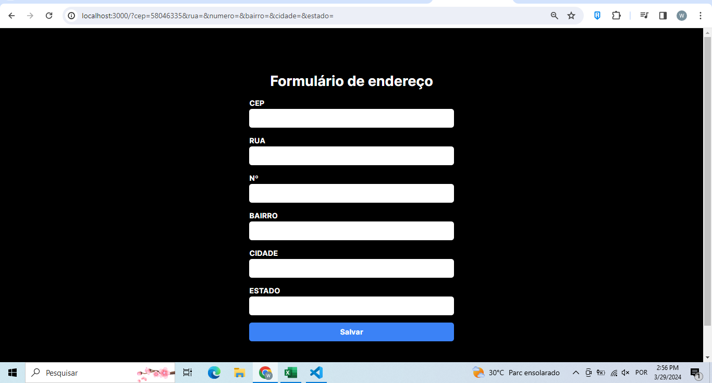
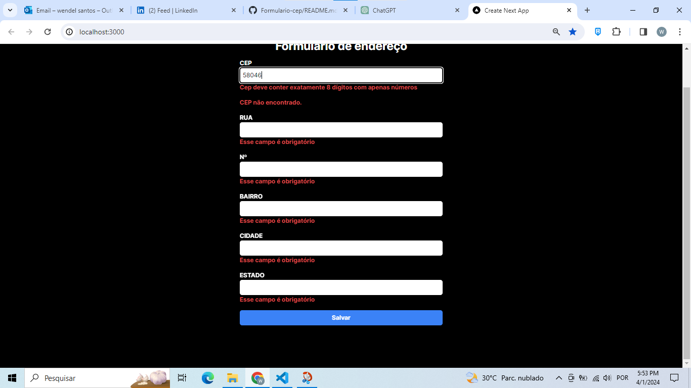
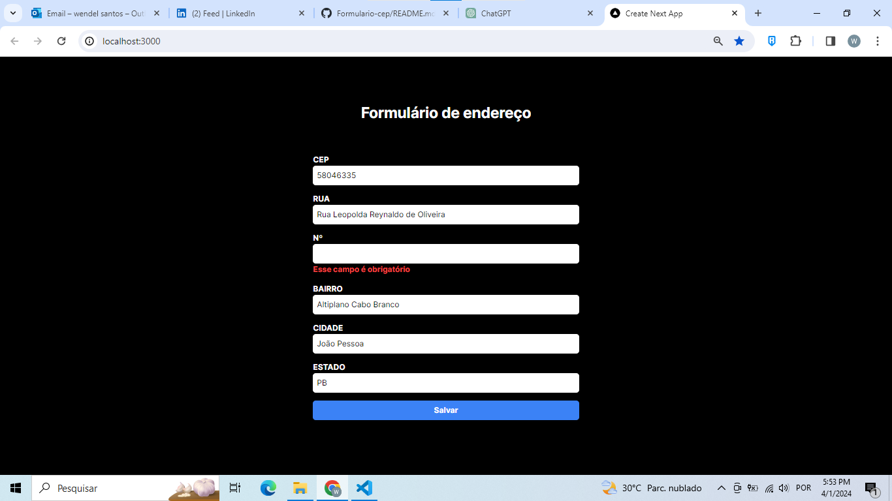

## Olá pessoal, apresento a vocês o formulário Cep utilizando o React Hook Form e a Biblioteca Zod.

- Conceitos abordados sobre React, Tailwind, Zod, Hook Form e consumo de API;
- Criação de um formulário com preenchimento automático de endereço após o cep válido ser digitado.
- Uso da API https://viacep.com.br/. 
- Validações de Erros.

- O projeto se resume a um cadastro de CEP, inserido pelo usuário, resultando nos dados de endereço do CEP inserido nos outros campos imput disponiveis automaticamente, com o uso do Reac Hook form  oferecendo um desempenho otimizado, pois minimiza a quantidade de renderizações necessárias. Além disso estou utilizando a biblioteca Zod para tratamento de erros e validação dos tipos de dados, para garantir que correspondam à estrutura esperada. Ademais, utilizei o Tailwind para estilizar o simples formulário, excelentes ferramentas para validação e desempenho de uma aplicação.

- Segue imagem do formulário antes da busca:

- Segue imagem após uma busca errada feita pelo usuário:

- Segue imagem após uma busca correta feita pelo usuário:

